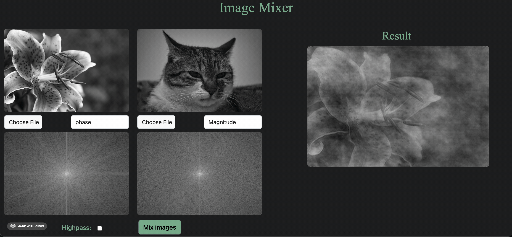

# Image Mixer

Image mixer is a website that merges phase and magnitude of different images using fourier transform.

## Table of Contents

- [Built with](#Built-with)
- [Deployment](#Deployment)
- [Design](#Design)
- [Features](#Features)
- [Authors](#Authors)


## Built with


## Deployment

 Install flask

```bash
  pip install flask
```
To start deployment 
```bash
  flask run
```

## 🖌️ Design


## Features
1. Mix 2 images(phase and magnitude)


2. Apply uniform phase


3. Apply uniform magnitude 


4. Apply highpass filter


     All rights reserved © 2022 to Team 21 - Systems & Biomedical Engineering, Cairo University (Class 2024)
